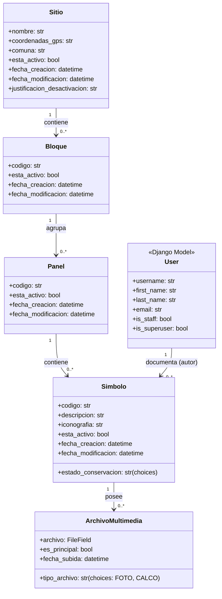

# Mi Proyecto - Diagrama de Clases

## Modelo de Datos

El siguiente diagrama representa la estructura de las principales entidades del sistema:

```mermaid
classDiagram
    class Sitio {
        +nombre: str
        +coordenadas_gps: str
        +comuna: str
        +esta_activo: bool
        +fecha_creacion: datetime
        +fecha_modificacion: datetime
        +justificacion_desactivacion: str
    }
    class Bloque {
        +codigo: str
        +esta_activo: bool
        +fecha_creacion: datetime
        +fecha_modificacion: datetime
    }
    class Panel {
        +codigo: str
        +esta_activo: bool
        +fecha_creacion: datetime
        +fecha_modificacion: datetime
    }
    class Simbolo {
        +codigo: str
        +descripcion: str
        +iconografia: str
        +estado_conservacion: str (choices)
        +esta_activo: bool
        +fecha_creacion: datetime
        +fecha_modificacion: datetime
    }
    class ArchivoMultimedia {
        +tipo_archivo: str (choices: FOTO, CALCO)
        +archivo: FileField
        +es_principal: bool
        +fecha_subida: datetime
    }
    class User {
        <<Django Model>>
        +username: str
        +first_name: str
        +last_name: str
        +email: str
        +is_staff: bool
        +is_superuser: bool
    }

    Sitio "1" --> "0..*" Bloque : contiene
    Bloque "1" --> "0..*" Panel : agrupa
    Panel "1" --> "0..*" Simbolo : contiene
    Simbolo "1" --> "0..*" ArchivoMultimedia : posee
    User "1" --> "0..*" Simbolo : documenta (autor)
```